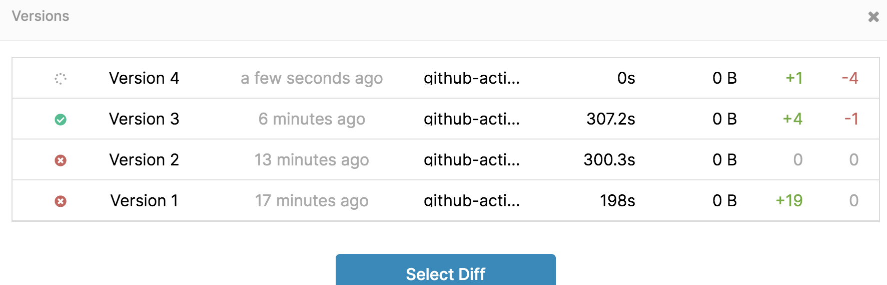
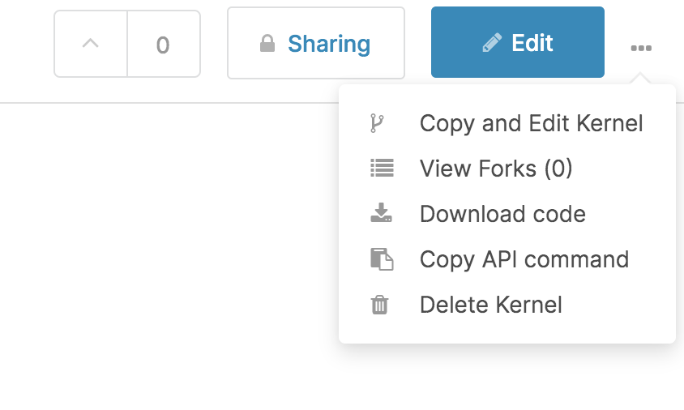

<p align="center">
  <a href="https://github.com/marketplace/actions/bandit-report-artifacts">
    
  </a>
</p>

<h1 align="center">
  Github action to push [Kaggle](https://kaggle.com) kernels from github and also for submitting them to their respective competitions.
</h1>

<p align="center">
  This is a <a href="https://github.com/features/actions">GitHub Action</a> which will push your kernels to <a href="https://kaggle.com">Kaggle</a> And also submit them to your competitions.
</p>

<p align="center">
  
</p>
<p align="center">
  
</p>

## Usage

```yml
name: Kaggle kernel actions

on:
  push:
    branches:
      - master

jobs:
  build:
    runs-on: ubuntu-latest
    strategy:
      matrix:
        os: [ ubuntu-latest, macos-latest ]
        python-version: [ '2.7.17', '3.6.10' ]
    name: Python ${{ matrix.python-version }} ${{ matrix.os }} 

    steps:
    - uses: actions/checkout@v2

    - name: Push kernel to kaggle
      uses: joelhanson/kaggle-kernel-actions
      with:
        kaggle_username: ${{ secrets.kaggle_username }}
        kaggle_key: ${{ secrets.kaggle_key }}
        kaggle_make_new_kernel: true
        kaggle_metadata_path: kernel-metadata.json
        kernel_id: <username>/<kernel_slug>
        competition: titanic
```


### Getting Started :airplane:

You can include the action in your workflow to trigger on any event that [GitHub actions supports](https://help.github.com/en/articles/events-that-trigger-workflows). If the remote branch that you wish to deploy to doesn't already exist the action will create it for you. Your workflow will also need to include the `actions/checkout` step before this workflow runs in order for the deployment to work.


If you'd like to make it so the workflow only triggers on push events to specific branches then you can modify the `on` section.

```yml
on:
  push:
    branches:
      - master
```

### Configuration 📁

The `with` portion of the workflow **must** be configured before the action will work. You can add these in the `with` section found in the examples above. Any `secrets` must be referenced using the bracket syntax and stored in the GitHub repositories `Settings/Secrets` menu. You can learn more about setting environment variables with GitHub actions [here](https://help.github.com/en/articles/workflow-syntax-for-github-actions#jobsjob_idstepsenv).

#### Required Setup

One of the following deployment options must be configured.

| Key                | Value Information                                                                                                                                                                                                                                                                                                                                     | Type   | Required | Default |
| ------------------ | ----------------------------------------------------------------------------------------------------------------------------------------------------------------------------------------------------------------------------------------------------------------------------------------------------------------------------------------------------- | ------ | -------- | -------- |
| `kaggle_username`          | You should provide kaggle username.'                                                                                                                           | `secrets`           | **Yes**  | <username> |
| `kaggle_key` | To provide you kaggle access key to learn for [visit](https://github.com/Kaggle/kaggle-api#api-credentials).                                                                                                 | `secrets` | **YES**  | <key> |
| `kernel_id` | The id for the kaggle kernel example: `username/kernel-slug`.                                                                                                 | `with` | **Yes**  | false |
| `kaggle_make_new_kernel` | This is make new kernel when the kernel id does not exist the current existing ones.                                                                                                 | `with` | **No**  | false |
| `kaggle_metadata_path` | The metadata path for the kaggle kernel. The metadata details can be found [here](https://github.com/Kaggle/kaggle-api/wiki/Kernel-Metadata). To create one you can run `kaggle kernel init`. Either the metadata file or the metadata details should be provided for this github action to work.                                                                                                 | `with` | **No**  | . |
| `kernel_id_no` | This is the kernel number which is got when pull an already existing kernel.                                                                                                 | `with` | **No**  |  |
| `kernel_title` | The title of the kernel. Required for new kernels - optional for existing ones. Please be aware that kernel titles and slugs are linked to each other. A kernel slug is always the title lowercased with dashes (-) replacing spaces. (If you wish to rename your kernel, you may change the title within the metadata. However, you will need to update the id as well AFTER the rename is complete.)                                                                                                 | `with` | **No**  |  |
| `code_file_path` | The path to the code file. This should be provided in the metadata file or as input.                                                                                                 | `with` | **Yes**  | . |
| `language` | The language your kernel is written in. Valid options are python, r, and rmarkdown. Required.This should be provided in the metadata file or as input                                                                                                 | `with` | **No**  | python |
| `kernel_type` | The type of kernel. Valid options are script and notebook. Required.                                                                                                 | `with` | **No**  | notebook |
| `is_private` | Whether or not the kernel should be private. If not specified, will be true.                                                                                                 | `with` | **No**  | true |
| `enable_gpu` | Whether or not the kernel should run on a GPU. If not specified, will be false.                                                                                                 | `with` | **No**  | false |
| `enable_internet` | Whether or not the kernel should be able to access the internet. If not specified, will be false.                                                                                                 | `with` | **No**  | false |
| `competition` | The name of the competition that you are working on. Providing this will automatically get the datasets from the competition to the kernel inputs. A  competition, specified as "competition-slug"                                                                                                  | `with` | **No**  |  |
| `dataset_sources` | A list of dataset sources, specified as "username/dataset-slug".                                                                                                 | `with` | **No**  |  |
| `competition_sources` | A list of competition sources, specified as "competition-slug".                                                                                                 | `with` | **No**  |  |
| `kernel_sources` | A list of kernel sources, specified as "username/kernel-slug".                                                                                                 | `with` | **No**  |  |
| `deploy_kernel` | This will tell the action to push the kernel to kaggle or not.                                                                                                 | `with` | **No**  | true |
| `submit_to_competition` | This is a boolean flag to submit the kernel if specified true.(still in progress)                                                                                                 | `with` | **No**  | false |
| `submition_message` | This will override the default submission message (<git-hash> <git-commit-msg> ) with this message specified here.                                                                                                 | `with` | **No**  | <git-hash> <git-commit-msg> |
| `collect_output` | This is to tell the action to save the output of the kernel run as zip. GitHub will save your cache but will begin evicting caches until the total size is less than 2 GB.                                                                                                | `with` | **No**  | false |

---

### Artifacts 📁

You can get the outputs as artifacts, for example the output accuracy and the models can be saved. Hence can get this output from the workflow artifacts. [learn more about artifacts](https://help.github.com/en/actions/configuring-and-managing-workflows/persisting-workflow-data-using-artifacts).

The following is example of how to download the artifacts.

```yaml
name: Push notebook to kaggle

on: push

jobs:
  deploy:
    runs-on: ubuntu-latest
    strategy:
      matrix:
        os: [ ubuntu-latest, macos-latest ]
        os: [ ubuntu-latest ]
        python-version: [ '2.7.17', '3.6.10' ]
    name: Python ${{ matrix.python-version }} ${{ matrix.os }}

    - name: Kaggle deploy as new
      uses: joelhanson/kaggle-kernel-actions
      with:
        kaggle_username: ${{ secrets.kaggle_username }}
        kaggle_key: ${{ secrets.kaggle_key }}
        kaggle_make_new_kernel: true
        kernel_id: <username>/<kernel_slug>
        code_file_path: <folder>/<file_path_to.ipynb>
        kernel_title: <kernel_title>
        language: python
        kernel_type: notebook
        is_private: true
        enable_gpu: false
        enable_internet: false
        competition: titanic
        submit_to_competition: false
        collect_output: true

    - name: Download outputs
      uses: actions/upload-artifact@v1
      with:
        name: outputs
        path: outputs/outputs.zip
```

---

### Submit kernels (In progress)

You can submit kernels by adding the following inputs for the jobs

```yml
    - name: Kaggle deploy from existing metadata file
      uses: ./
      with:
        kaggle_username: ${{ secrets.kaggle_username }}
        kaggle_key: ${{ secrets.kaggle_key }}
        kaggle_make_new_kernel: true
        kaggle_metadata_path: test/kernel-metadata.json
        kernel_id: joelhanson/github-action-test
        competition: titanic
        submit_to_competition: true  # This needs to be true
```

### Further Actions 

You send notifications to you telegram or to slack by using some of the other actions provided in the [github marketplace](https://github.com/marketplace?type=actions)

### License 👨🏻‍💻

The Dockerfile and associated scripts and documentation in this project are released under the [MIT License](LICENSE).

Container images built with this project include third party materials. As with all Docker images, these likely also contain other software which may be under other licenses. It is the image user's responsibility to ensure that any use of this image complies with any relevant licenses for all software contained within.

### FAQ

1. Where to find the kernel_id?

You can find the kernel_id by going to the top menu of the kernel and clicking `copy api command`.
